​	本文介绍了如何随时随地使用图形化界面连接校园内虚拟机。。。

<!--more-->

# 连接步骤

## 1、连接虚拟机前，确保自己电脑处于校园网环境下。

## 2、如果没有校园网，可以使用东北大学VPN连接校园网。

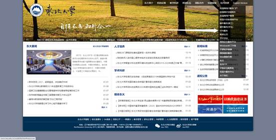

 

以Windows10环境为例，下载对应压缩包

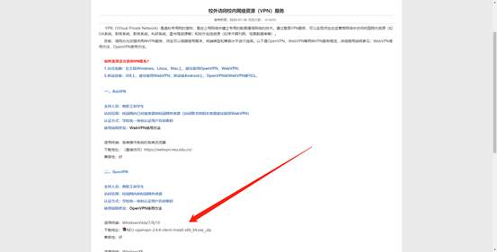

## 3、下载好后，点击进行安装，选择自己的安装路径一路默认即可。

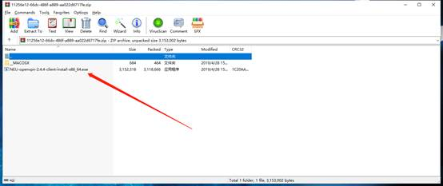

## 4、在安装目录下找到bin文件夹，右键以管理员身份打开openvpn-gui.exe，否则会导致连接失败。

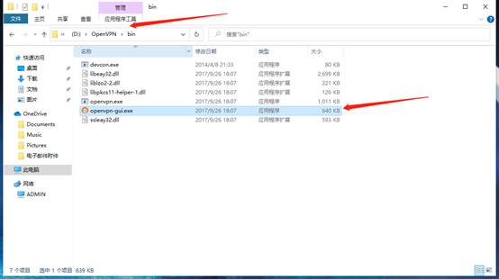

 

## 5、在电脑任务栏中找到openVPN图标。右键-学生VPN-connect，在弹框内输入校园网账号即可。

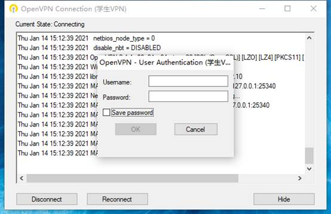

 

## 6、安装VNC-Viewer-6.20.529-Windows，同样选择自己安装路径一路默认即可。

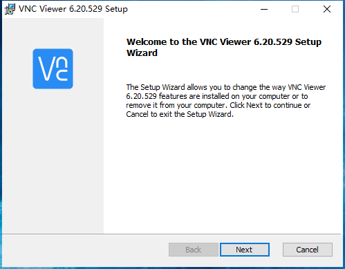

 

## 7、打开VNC Viewer，在地址栏输入框输入下面三个其中一个地址即可。

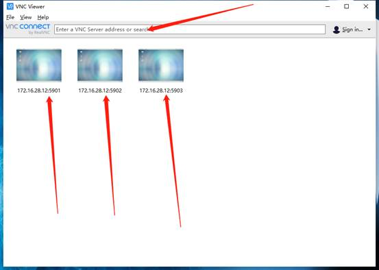

 

## 8、提示输入密码时，输入123456

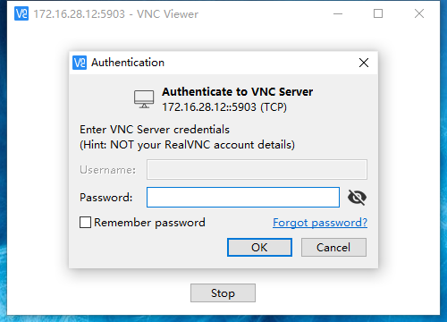

## 9、此时进入了虚拟机图形化界面，密码同样为123456


 

## 10、不使用后直接关闭窗口，千万不要关机，否则无法连接。

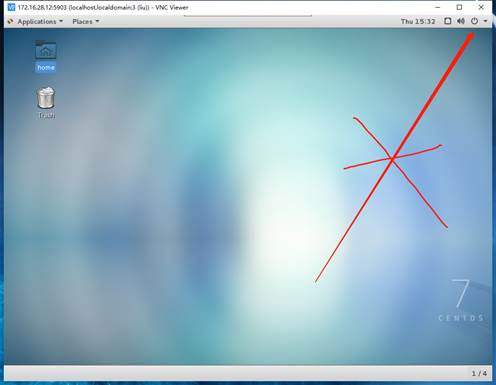

 

## 11、需要文件传输时，使用Xftp，新建连接，输入箭头三处信息，密码123456。

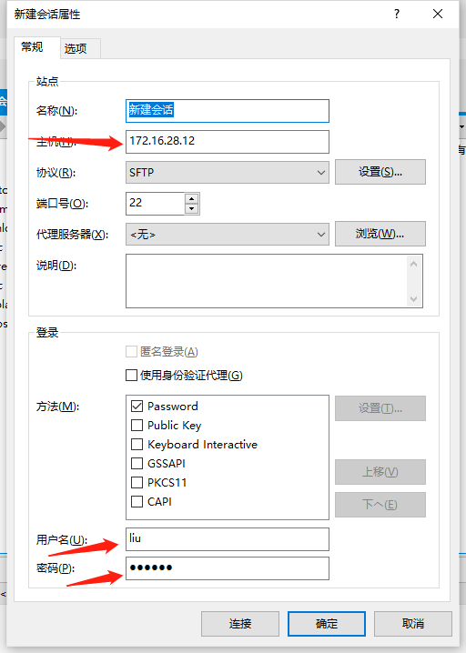

 

 

## 12、对文件进行拖拽就可以进行传输。

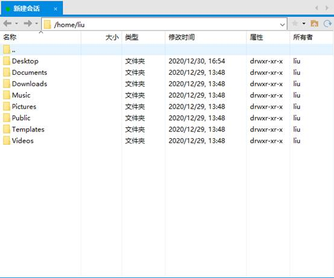

---

# 博客添加图片

为了添加图片，真的是绕了很多弯路，甚至丢失了我写了两天的笔记，认识到自己有不爱保存的坏习惯，以后要改正，以免因小失大。

添加图片不仅要修改**博客 _config.yml**，而且需要安装一个小插件，不然会出现图片路径混乱的问题，比如说多了一层文件夹，所以就找不到图片文件，也就显示不出来。

下面给出步骤：

## 1、post_asset_folder

**_config.yml**中修改**post_asset_folder:true**

## 2、hexo-asset-image

在hexo的目录下执行

```cpp
npm install https://github.com/CodeFalling/hexo-asset-image --save
```

## 3、附

如果使用Typora写博客，最好在偏好设置--图像中，选择复制到指定路径 **./{filename}**

